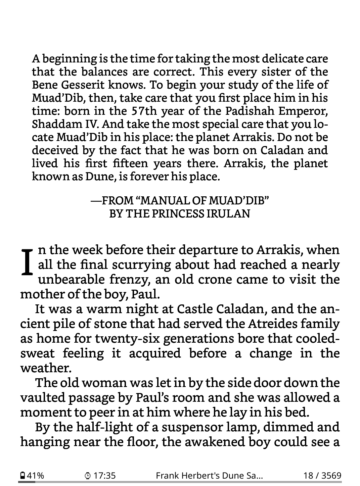
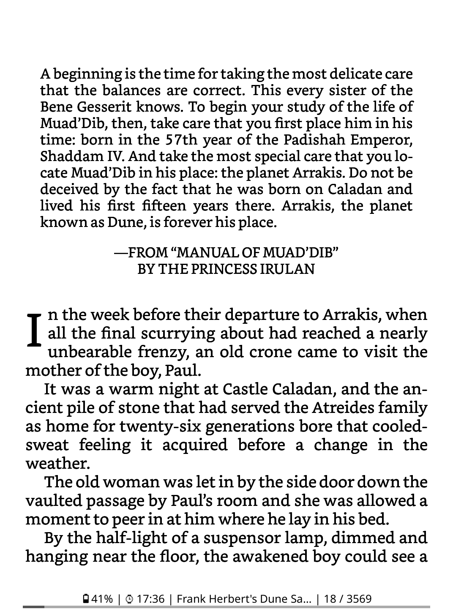

# Justify KOReader Status bar

This is my attempt to distribute all the items in the KOReader status bar to be spread apart across the width of the device and be equally spaced.

There is no need to edit the patch file in any way. It will work out of the box with whatever items have been configured in the status bar menu. To see all the entries equally spaced, choose the menu option: `Status bar` > `Configure items` > `Alignment` > `Justify`.

## Patch
Things I still want to add on to the patch:

- [ ] Implement grouping together of status bar items.

## Usage
1. Download the .
1. Move this patch over to the `koreader/patches` folder.
1. Restart KOReader.
1. Set `Alignment` to `Justify` in the menu.

## Screenshots

*Status bar containing 3 items with Aligngment set to Justify*

*Status bar containing 4 items with Aligngment set to Justify*

*Status bar containing 4 items with Aligngment set to Center*

## Disclaimer
The patch is not very well tested.
